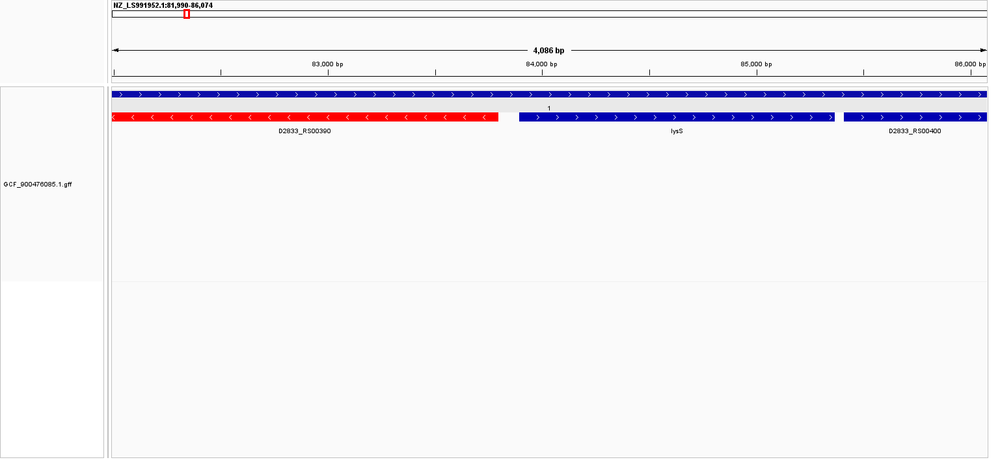
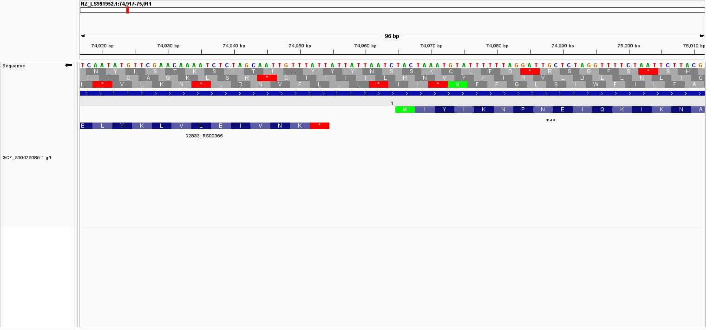

# Mycoplasmoides gallisepticum genome analysis

This directory contains a small, reproducible workflow for downloading and organizing the NCBI RefSeq assembly `GCF_900476085.1` for *Mycoplasmoides gallisepticum* strain NCTC10115.

## Workflow usage

Requirements:

pixi envionment with the following installed packages:
- GNU Make
- NCBI `datasets` command-line tool
- `unzip`
- `find`
- Python 3 (used by the summary command)

From this directory, run:

```bash
make all
```

The default target runs `move`, which downloads the assembly and GFF3 annotation, unpacks the NCBI data package, creates the organized `data/fna/` and `data/gff/` directories, renames the files using the accession, and removes the temporary accession directory. It then runs `summary`, which prints the genome size, chromosome count, and annotation count.

Individual stages can also be run as follows:

```bash
make download   # download the NCBI Datasets package
make unzip      # unpack it into the data directory
make organize   # create fna/ and gff/ directories
make move       # copy and rename the sequence and annotation files
make summary    # calculate the three summary values
make clean      # remove the downloaded/organized package
```

If the package has already been downloaded, the workflow uses the existing files. To reproduce the complete download from scratch, run `make clean`

Original NCBI directory organization is stored in 
```bash
directory_after_unzip.txt
```

## Data organization

The data are organized by file purpose rather than placing every downloaded file in the top-level directory:

```text
week02/
├── Makefile
└── downloads_GCF_900476085.1/
    ├── data/
    │   ├── fna/GCF_900476085.1.fna    # genomic nucleotide sequence
    │   ├── gff/GCF_900476085.1.gff    # genome annotation
    │   ├── assembly_data_report.jsonl  # assembly metadata
    │   └── dataset_catalog.json        # NCBI package metadata
    ├── directory_after_unzip.txt
    ├── directory_after_move.txt
    └── md5sum.txt
```

The FASTA sequence and GFF annotation are kept in separate `fna/` and `gff/` directories. The downloaded package metadata and directory listings are retained alongside them for provenance.

## Limitations & other usage

As the genome accession is hard coded, this script may be adapted for other NCBI assembled genomes by changing line 1 for the desired genome

If a microbial genome has multiple independent fastas, such as a segmented virus, this script will not work

If any additional files outside of .fna or .gff3 are needed, those are hard coded in download and can be appended.

# Genome summary

The values below were calculated from the files in `data/fna/` and `data/gff/` by the Makefile's `summary` target.

| Question | Answer |
| --- | --- |
| How large is the genome? | **981,408 bp** |
| How many chromosomes does it have? | **1 chromosome** (`NZ_LS991952.1`) |
| How many annotation records are in the GFF file? | **1,635 records**, excluding comment/directive lines |
| How many gene records are present? | **765 genes** |

The annotation count includes all non-comment GFF records, including genes, CDS features, exons, RNAs, the chromosome region, and other sequence features. It is therefore larger than the gene count. The feature breakdown includes 754 CDS records, 765 gene records, 41 exons, 32 tRNAs, 6 rRNAs, 30 pseudogenes, and several additional RNA or regulatory features.

## Assembly completeness

NCBI describes it as a **Complete Genome**, and the FASTA contains one annotated chromosome sequence. Suggestive of a completely assembled genome. However, inspection of some genomic RNA features do not have any defined reading frames that exisit within the single feature, so I am curious how these annotations were generated if manually or from another reference genome.


## IGV visualization

The supplied FASTA and GFF were loaded into IGV. The GFF track displays annotated genomic features, especially genes and their corresponding CDS features; RNA transcripts/features are also shown where they are present in the annotation. Features were colored by strand orientation:

- **Blue:** forward (`+`) strand
- **Red:** reverse (`-`) strand

#### Example





### Gene packing

Most genomic features are **40–200 bp apart**, while a few are seperated by **400–2,000 bp**. 

### Coordinate 74,960

- At chromosome position **74,960**, the inspected forward strand base is **adenine (A)**. 
- This coordinate can fall in a frame producing **N**, **I**, or a **TAA  Ochre stop codon**. 
- On the reverse strand, the three codon frames correspond to an  **L**, **N**, or **I**. 

