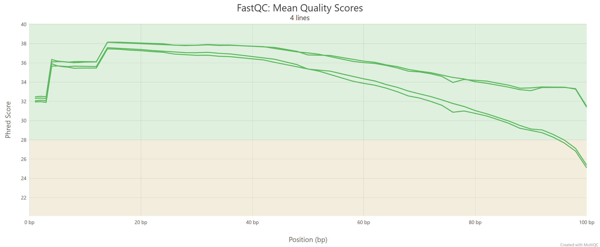

# Week 4: Downloading and QC-checking SRA reads for GCA_027936885.1 / JN542536.1

This project continues the genome selected in Week 2 ILTV[Downloading a genome assembly from NCBI (Gallid alphaherpesvirus 1)](week02_ILTV/README.md). 

The assembled genome corresponds to NCBI assembly: GCA_027936885.1, which corresponds to the accession JN542536.1 in genbank. The goal of this assignment was to locate public sequencing data for that genome, download a subset of reads from the Sequence Read Archive (SRA), and perform a simple quality-control workflow.

## Genome choice

The selected genome is:

- Assembly accession: GCA_027936885.1
- GenBank/RefSeq accession: JN542536.1
- SRA accession: SRR29869142

## Popularity of Gallid alphaherpesvirus 1 (infectious laryngotracheitis virus)

Breakdown of SRA datasets: [NCBI SRA datasets for ILTV](https://www.ncbi.nlm.nih.gov/sra?term=%28%22Gallid%20alphaherpesvirus%201%22%5BOrganism%5D%20OR%20%28%22Gallid%20alphaherpesvirus%201%22%5BOrganism%5D%20OR%20infectious%20laryngotracheitis%20virus%5BAll%20Fields%5D%29%29%20AND%20cluster_public%5Bprop%5D&cmd=DetailsSearch).

- Total datasets: 57
- Platform:
  - 31 Illumina
  - 26 Oxford Nanopore
- Types of data:
  - 26 Oxford Nanopore amplicon sequencing of partial genomes
  - 15 RNA-seq of host transcriptome during infection
  - 16 WGS of ILTV (Illumina)


Unfortunately, a majority of sequenced ILTV data is not represented in the SRA; see the NCBI genome dataset page: [NCBI genome datasets for ILTV](https://www.ncbi.nlm.nih.gov/datasets/genome/?taxon=10386).

File type breakdown

    - 45 fastq (Oxford Nanopore amplicon seq, illumina WGS, illumina RNAseq)

    - 12 bam format (Illumina RNAseq)

Compared to gallid alphaherpesvirus 2 (Mareks Disease Virus), there are far less genomes (16 vs ~200) and RNAseq data for ILTV: [NCBI SRA datasets for MDV](https://www.ncbi.nlm.nih.gov/sra?term=MDV%5BAll%20Fields%5D%20OR%20%28%22Gallid%20alphaherpesvirus%202%22%5BOrganism%5D%20OR%20Mareks%20Disease%20virus%5BAll%20Fields%5D%29%20OR%20%28%22Gallid%20alphaherpesvirus%202%22%5BOrganism%5D%20OR%20Gallid%20alphaherpesvirus%202%5BAll%20Fields%5D%29&cmd=DetailsSearch).

## Downloading a subset of reads from the SRA

The following makefile will download the reads corresponding to ILTV strain 63140 SRA accession: SRR29869142. 

Multiple dependencies are requiured to perform quality control and analysis, so be sure to confirm those are installed before executing.

To execute download:

```bash
make all
```

Download is initiated by:

```bash
	fastq-dump -X $(N) --outdir fastq --split-files $(SRA_ACCESSION)
```

Where N = number of reads to download, manually entered in Makefile


## QC Analysis 

### QC Method

Reads were quality controlled via adapter trimming and trimming ends of low quality bases using the following:

```bash
# Trim adapters and poor-quality tails from the raw reads.
trim: $(TRIMMED_R1) $(TRIMMED_R2)

$(TRIMMED_R1) $(TRIMMED_R2): $(RAW_R1) $(RAW_R2)
	fastp --adapter_sequence=$(ADAPTER) \
	      --cut_tail \
	      -i $(RAW_R1) \
	      -I $(RAW_R2) \
	      -o $(TRIMMED_R1) \
	      -O $(TRIMMED_R2)
```

### QC Comparison

Read-position quality plot showed terminal base quality improved after trimming low quality bases by a marginal Phred score. Suggesting this minimal QC did improve read quality.



It should be noted not read average Phred quality scores were used to exclude low quality reads in this analysis. However this can be included by changing trim to the following:

```bash
trim: $(TRIMMED_R1) $(TRIMMED_R2) 

$(TRIMMED_R1) $(TRIMMED_R2): $(RAW_R1) $(RAW_R2)
	fastp --adapter_sequence=$(ADAPTER) \
	      --cut_tail \
	      --length_required 50 \
	      --qualified_quality_phred 20 \
	      --unqualified_percent_limit 10 \
	      -i $(RAW_R1) \
	      -I $(RAW_R2) \
	      -o $(TRIMMED_R1) \
	      -O $(TRIMMED_R2)
```


